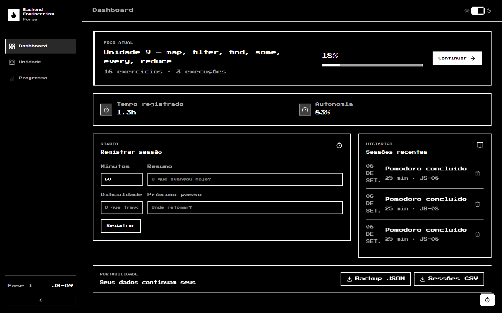
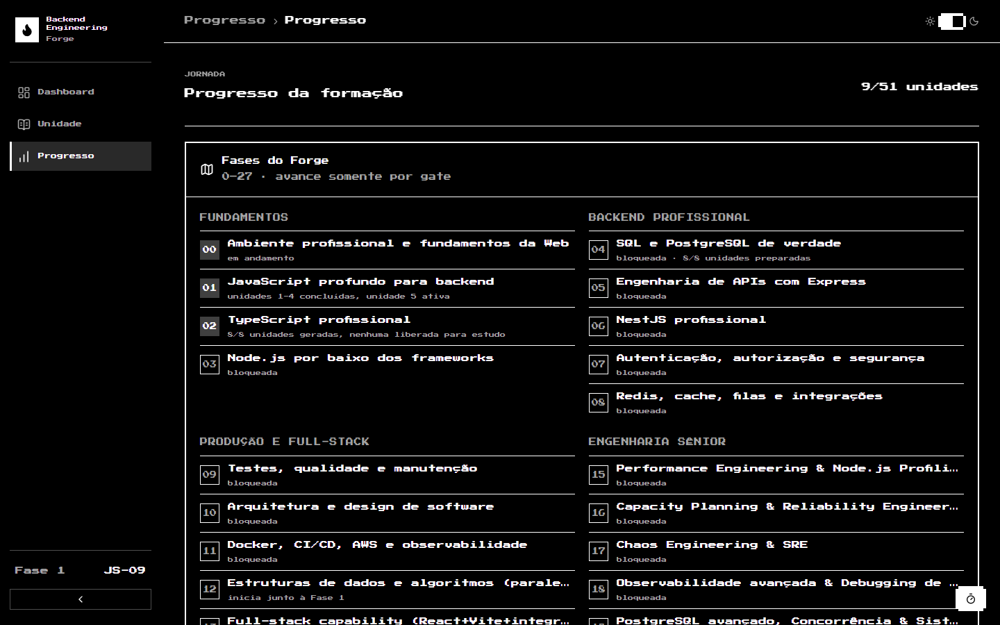
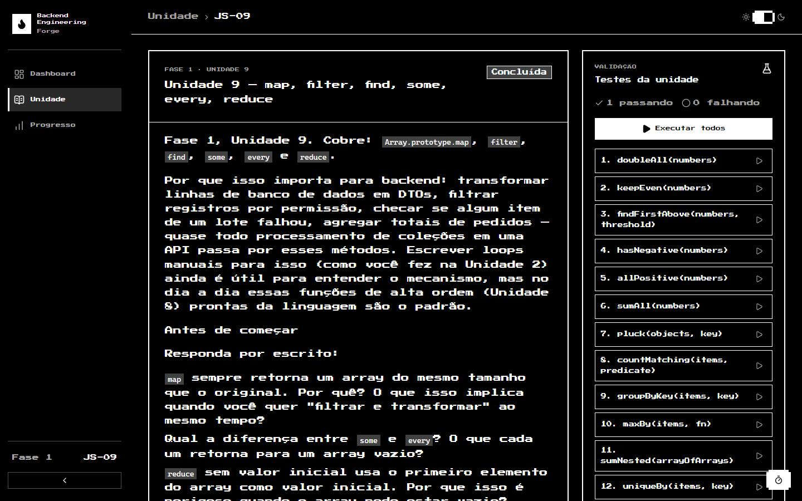
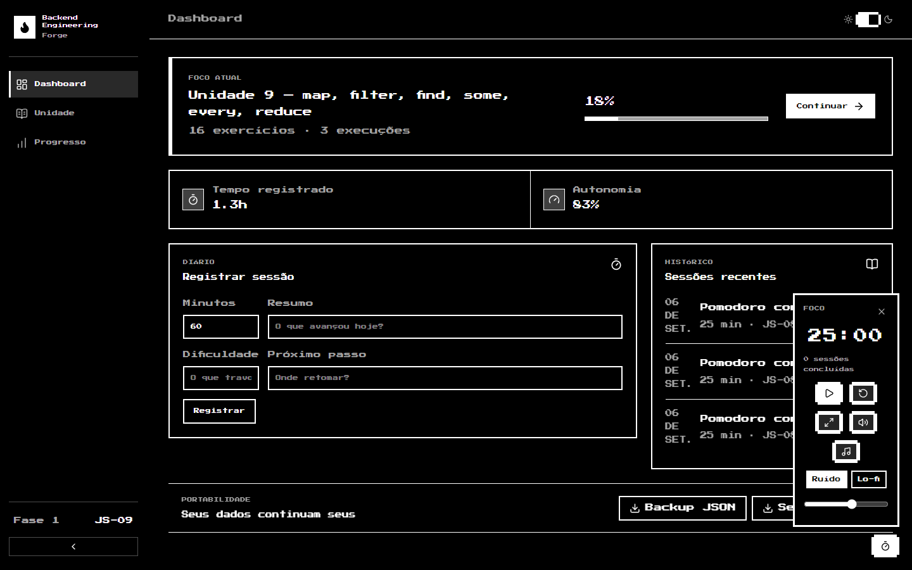
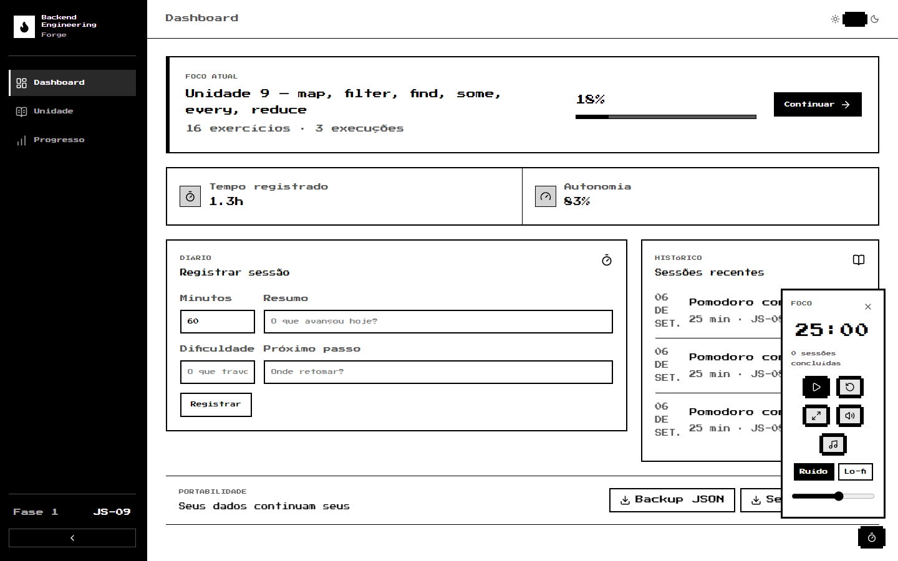
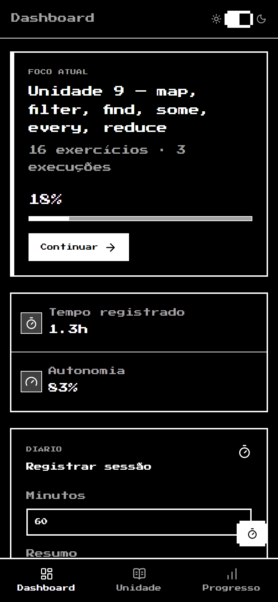

# Backend Engineering Forge

Formação backend-first, orientada a projetos, para dominar JavaScript,
TypeScript, Node.js, NestJS, PostgreSQL, segurança, cloud e engenharia
full-stack aplicada — com um painel web local que acompanha cada unidade,
teste, dica e revisão.



> Concluir esta trilha não transforma alguém automaticamente em
> desenvolvedor pleno. Senioridade também exige experiência real,
> responsabilidade em produção, colaboração e capacidade de lidar com
> problemas ambíguos. O objetivo aqui é desenvolver **competências
> técnicas e comportamentais compatíveis com um backend pleno**.

## Sumário

- [O que é](#o-que-é)
- [Estado atual](#estado-atual)
- [Painel web local](#painel-web-local)
- [CLI](#cli)
- [Como funciona uma unidade](#como-funciona-uma-unidade)
- [Roadmap](#roadmap)
- [Como rodar](#como-rodar)
- [Estrutura do repositório](#estrutura-do-repositório)
- [Stack das ferramentas](#stack-das-ferramentas)
- [Documentos de acompanhamento](#documentos-de-acompanhamento)

## O que é

O Forge é três coisas no mesmo repositório:

1. **Um currículo** em 28 fases (0–27), do JavaScript básico até engenharia
   de confiabilidade e sistemas distribuídos.
2. **Exercícios com testes** — cada unidade tem aula em Markdown, um
   `exercises.js` para implementar e um `exercises.test.js` que valida.
3. **Ferramentas locais** (CLI + painel web) que registram sessões, liberam
   dicas progressivas, fecham gates e agendam revisões espaçadas.

Estratégia de tempo:

```text
80% backend e engenharia de software
20% frontend para capacidade full-stack
```

Ordem macro:

```text
JavaScript → TypeScript → Node.js → HTTP → PostgreSQL/SQL
→ API com framework leve → NestJS → autenticação/autorização/segurança
→ Redis, filas e integrações → arquitetura e qualidade
→ Docker, CI/CD, AWS e observabilidade → React/Vite + integração real → Tailwind CSS
→ projeto full-stack
```

Não começamos por microsserviços, nem por Kubernetes, nem pelo frontend.

## Estado atual

> Retrato de **2026-10-06**. A fonte oficial e sempre atualizada é
> [`PROGRESS.md`](PROGRESS.md); se este bloco divergir dela, vale o
> `PROGRESS.md`.

| Frente | Situação |
| --- | --- |
| Fase 0 — Ambiente e fundamentos da Web | 🟡 em andamento (repositório, lint, testes e painel prontos; tópicos conceituais pendentes) |
| Fase 1 — JavaScript profundo | 🟡 unidades 1–8 com gate fechado, **Unidade 9 (map/filter/reduce) ativa**, 10–27 já geradas |
| Fase 2 — TypeScript | ⚪ 8/8 unidades geradas, nenhuma liberada |
| Fase 3 — Node.js | ⚪ bloqueada (7 unidades preparadas) |
| Fase 4 — SQL e PostgreSQL | ⚪ bloqueada (8/8 unidades + ambiente Docker + Projeto 4 preparados) |
| Fase 12 — DSA em paralelo | 🟡 Sessão 01 (Big O + arrays) entregue, aguardando tentativa |
| Project 01 — Order Workbench CLI | 🟢 gate fechado: 12/12 testes, retrospectiva e explicação oral |
| Project 04 — Marketplace Database Lab | ⚪ material preparado, libera após `sql-08` |
| Trilha poliglota (Java / .NET / Go) | ⚪ bloqueada até o gate da Fase 9 |

Números do momento:

- **51 unidades** catalogadas (27 JS · 8 TS · 7 Node · 8 SQL · 1 DSA).
- **Suíte de sistema: 26/26 testes verdes** (`npm run test:system`).
- **21 revisões espaçadas pendentes** e 1 agendada (`npm run forge -- review`).
- **Autonomia: 83%** (métrica baseada no nível de dica revelado).



## Painel web local

Roda só em `127.0.0.1`, sem conta, sem hospedagem e sem container:

```bash
npm run forge:web
```

Abra `http://127.0.0.1:4310`. São três telas, mais um Pomodoro flutuante.

### Dashboard

Foco atual, tempo registrado, métrica de autonomia, diário de sessões e
exportação dos dados (JSON/CSV). É a primeira imagem deste README.

### Unidade

Aula em Markdown à esquerda; à direita, os testes da unidade — executáveis
um a um ou todos de uma vez, direto pelo navegador. É também onde ficam as
dicas progressivas e o fechamento do gate.



### Progresso

Todas as fases (0–27) agrupadas por parte da formação, com o status de cada
uma e as unidades de cada fase. A imagem está na seção
[Estado atual](#estado-atual).

### Pomodoro, tema claro e mobile

O Pomodoro registra a sessão sozinho ao terminar e tem ruído/lo-fi
embutidos. O painel tem tema claro e escuro e layout responsivo com
navegação inferior no celular.

| Pomodoro aberto | Tema claro |
| --- | --- |
|  |  |

<p align="center">
  
</p>

Arquitetura do painel:

```text
React local
    │
    ▼
API Node/Express ─────── Markdown e arquivos de teste
    │
    ├─────────────── execução permitida de node --test
    │
    ▼
SQLite local (.forge/forge.db)
```

O executor nunca aceita caminho arbitrário vindo do navegador: a unidade é
descoberta no currículo e o teste precisa estar dentro do workspace. Detalhes
em [`docs/architecture/forge-web-local.md`](docs/architecture/forge-web-local.md).

## CLI

Tudo que o painel faz também existe no terminal:

```bash
npm run forge -- status
```

```text
Backend Engineering Forge — status

Foco atual: Unidade 9 — map, filter, find, some, every, reduce (js-09)
Tempo total: 1.3h (75 min)
Unidades concluídas: 9/51
Revisões pendentes: 21
```

| Comando | O que faz |
| --- | --- |
| `status` | mostra o estado atual |
| `log` | registra uma sessão de estudo |
| `focus <js-02>` | define a unidade ativa |
| `test [js-02]` | executa os testes de uma unidade |
| `hint <1\|2\|3>` | revela uma dica progressiva |
| `progress` | lista todas as unidades |
| `review` | lista revisões agendadas |
| `next` | avança após concluir o gate |
| `export [json\|csv]` | exporta seus dados |
| `import <json> --replace` | restaura um backup |

## Como funciona uma unidade

```text
ler a aula → responder as perguntas iniciais → implementar exercises.js
→ rodar os testes → (dica 1/2/3 só se travar) → fechar o gate → revisar
```

- **Gate:** a unidade só é concluída com a suíte verde, uma reflexão escrita
  de pelo menos 30 caracteres e confiança informada ≥ 3.
- **Revisão espaçada:** fechar o gate agenda revisões em 2, 7 e 30 dias.
- **Autonomia:** o nível mais alto de dica revelada é registrado. Não é nota;
  serve para perceber a ajuda diminuindo com a prática.
- **Avanço:** uma fase só anda com `PROXIMA_UNIDADE`, depois do gate anterior.

As regras completas do método e da mentoria estão em
[`LEARNING_CONTRACT.md`](LEARNING_CONTRACT.md).

## Roadmap

```text
PARTE I   — Backend Foundations              (Fases 0-3)
PARTE II  — Professional Backend Engineering (Fases 4-8)
PARTE III — Production Backend Engineering   (Fases 9-14, até Pleno + full-stack capability)
PARTE IV  — Senior Backend Engineering       (Fases 15-27, após Pleno)
```

Progressão completa: Fundamentos → Backend Engineering → Backend Pleno →
Full-stack capability (React + Vite + TanStack Query + React Hook Form +
Zod, integrado de ponta a ponta com a API NestJS; Next.js só como módulo
opcional de empregabilidade, Fase 13.6) → Production Engineering →
Reliability Engineering → Distributed Systems → Senior Backend
Engineering.

A Parte IV trata senioridade como responsabilidade por sistemas em
produção (performance, confiabilidade, segurança, sistemas distribuídos,
operação, incidentes, arquitetura, liderança técnica) — não como "mais
frameworks". Tabela fase a fase em [`ROADMAP.md`](ROADMAP.md); índice
completo em [`BACKEND_ENGINEERING_FORGE.md`](BACKEND_ENGINEERING_FORGE.md).

### Trilha poliglota opcional

Depois do gate da Fase 9, será possível selecionar uma única especialização
em Java/Spring, C#/.NET ou Go. TypeScript, Node.js e NestJS continuam sendo a
formação principal, com divisão aproximada de 70%/30% depois da escolha.

As três opções estão bloqueadas e nenhuma foi selecionada. Veja
[`docs/tracks/POLYGLOT_BACKEND_TRACK.md`](docs/tracks/POLYGLOT_BACKEND_TRACK.md).

## Como rodar

Requer Node.js 24 ou superior.

```bash
npm install
npm test
```

`npm test` executa somente a unidade ativa. A infraestrutura tem uma suíte
separada, que deve permanecer sempre verde:

| Comando | Para quê |
| --- | --- |
| `npm test` | testes da unidade ativa |
| `npm run test:unit -- js-02` | testes de uma unidade específica |
| `npm run test:system` | suíte das ferramentas do Forge |
| `npm run test:dsa` | sessão de DSA |
| `npm run test:project-01` | Project 01 — Order Workbench CLI |
| `npm run test:all` | tudo |
| `npm run forge:web` | painel web local |
| `npm run forge -- <comando>` | CLI |
| `npm run lint` / `typecheck` / `format` | qualidade do código |
| `npm run sql:up` / `sql:down` / `sql:test` | PostgreSQL em Docker (Fase 4) |

Backups pelo terminal:

```bash
npm run forge -- export json
npm run forge -- export csv
```

## Estrutura do repositório

```text
exercises/      unidades por fase (01-javascript-core, 02-typescript-core,
                03-node-core, 04-sql-postgresql, 12-dsa-algorithms)
projects/       projetos progressivos (01-order-workbench-cli, 04-postgres-marketplace-lab)
labs/           laboratórios (http, database, node-runtime, queues, security, observability)
assessments/    gates de fase, code review, debugging, system design, mock interviews
solutions/      soluções de referência
notes/          anotações pessoais de estudo
docs/           currículo, arquitetura, ADRs, runbooks, postmortems, screenshots
tools/          forge-cli, forge-core, forge-sql, forge-web
.forge/         banco SQLite local com sessões e progresso (não versionado)
```

Mapa detalhado em [`docs/REPOSITORY_MAP.md`](docs/REPOSITORY_MAP.md).

## Stack das ferramentas

| Camada | Tecnologia |
| --- | --- |
| Runtime | Node.js 24, ES Modules |
| Testes | `node --test` (runner nativo) |
| API do painel | Express 5 |
| Interface | React 19, Vite 8, Tailwind CSS 4, Radix UI, tema 8-bit |
| Persistência | SQLite local |
| Conteúdo | Markdown com front matter (`gray-matter`, `react-markdown`) |
| Qualidade | ESLint 10, Prettier, TypeScript (typecheck do painel) |

## Documentos de acompanhamento

- [`PROGRESS.md`](PROGRESS.md) — o que já foi liberado e concluído (fonte oficial do estado).
- [`ROADMAP.md`](ROADMAP.md) — fases completas da formação.
- [`STUDY_LOG.md`](STUDY_LOG.md) — diário de sessões de estudo.
- [`SKILLS_MATRIX.md`](SKILLS_MATRIX.md) — estado de cada competência.
- [`LEARNING_CONTRACT.md`](LEARNING_CONTRACT.md) — regras do método de estudo e da mentoria.
- [`BACKEND_ENGINEERING_FORGE.md`](BACKEND_ENGINEERING_FORGE.md) — especificação completa da formação.
- [`docs/README.md`](docs/README.md) — índice da documentação por assunto.
- [`docs/REPOSITORY_MAP.md`](docs/REPOSITORY_MAP.md) — mapa curto para pessoas e agentes de IA.
- [`docs/architecture/forge-web-local.md`](docs/architecture/forge-web-local.md) — arquitetura do painel local.

### Comandos de mentoria

Ver [`LEARNING_CONTRACT.md`](LEARNING_CONTRACT.md) para a lista completa
(`INICIAR`, `PROXIMA_UNIDADE`, `SELECIONAR_TRILHA`, `REVISAR`, `DICA_1/2/3`,
`MOSTRAR_SOLUCAO`, `SIMULAR_BUG`, `SIMULAR_PR`, `AVALIAR_FASE`,
`GERAR_PROJETO`, entre outros).
